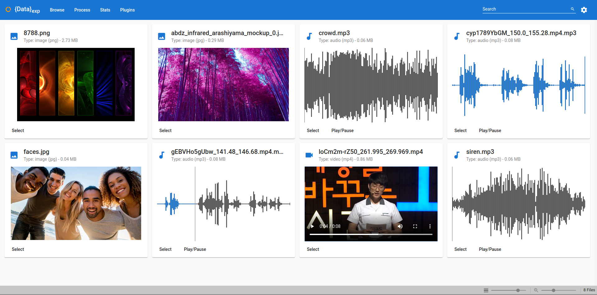

# Dataset Explorer

A web tool for local dataset browsing and processing developped using the Flask + Angular stack.


## Features

Dataset Explorer provides the following features:
   - Light weight and web-based (local server)
   - Easy visualization of data
   - Plugin-based tool system for easy data processing



## Getting Started

### Using Docker

A docker compose file is provided, you can start the tool with:
```shell script
docker-compose up -d
```

However, you must mount your dataset directory in the `/data` directory of the backend container. You can do so by updating the following line of the `docker-compose.yml` file:
```yaml
volumes:
  - ./data:/data # Replace '.data/' by the root path to your dataset
```
 

### From source

#### Backend (Flask)

The backend requires `Python 3.7`.
```shell script
cd backend
pip install -r requirements.txt
export DATASET_EXPLORER_ROOT=/path/to/dataset/root
python app.py
```

#### Frontend (Angular)

The frontend requires `Angular CLI v9.1.0` and `NodeJS v12.16.1`, make sure that they are installed first.
```shell script
cd frontend
npm install
ng serve
```

### Test tool

The app is available at http://127.0.0.1:4200.


## Write custom plugins/tools

Dataset Explorer allows you to write custom Python tools so that you can instantly test your own processing pipeline on your data. To do so you will need to create a class that inherits the `BasePlugin` class, the simplest plugin looks like this:
```python
# my_custom_plugin.py
import cv2
from dataset_explorer.filetypes import FileType
from dataset_explorer.plugins.base import BasePlugin


class MyCustomPlugin(BasePlugin):
    """
    MyCustomPlugin inherits from the BasePlugin class
    """

    def __init__(self):
        """
        The child class must provide a name as well as the input/output types of the plugin
        It's required that its constructor takes no argument
        """
        super(MyCustomPlugin, self).__init__("MyCustomPlugin", FileType.IMAGE, FileType.IMAGE)

    def process(self, inFilename, outFilename, **kwargs):
        """
        This method is called automatically, the inFilename argument is the path to the file to process
        The outFilename is the path to the result file that must be created
        For example, this function is converting the input image to black and white
        """
        image = cv2.imread(inFilename)
        image = cv2.cvtColor(image, cv2.COLOR_BGR2GRAY)
        cv2.imwrite(outFilename, image)
```

This file must be placed either at `~/.DatasetExplorer/plugins`, or at any directory listed in the environment variable `DATASET_EXPLORER_PLUGINS` (separated by `:`).

